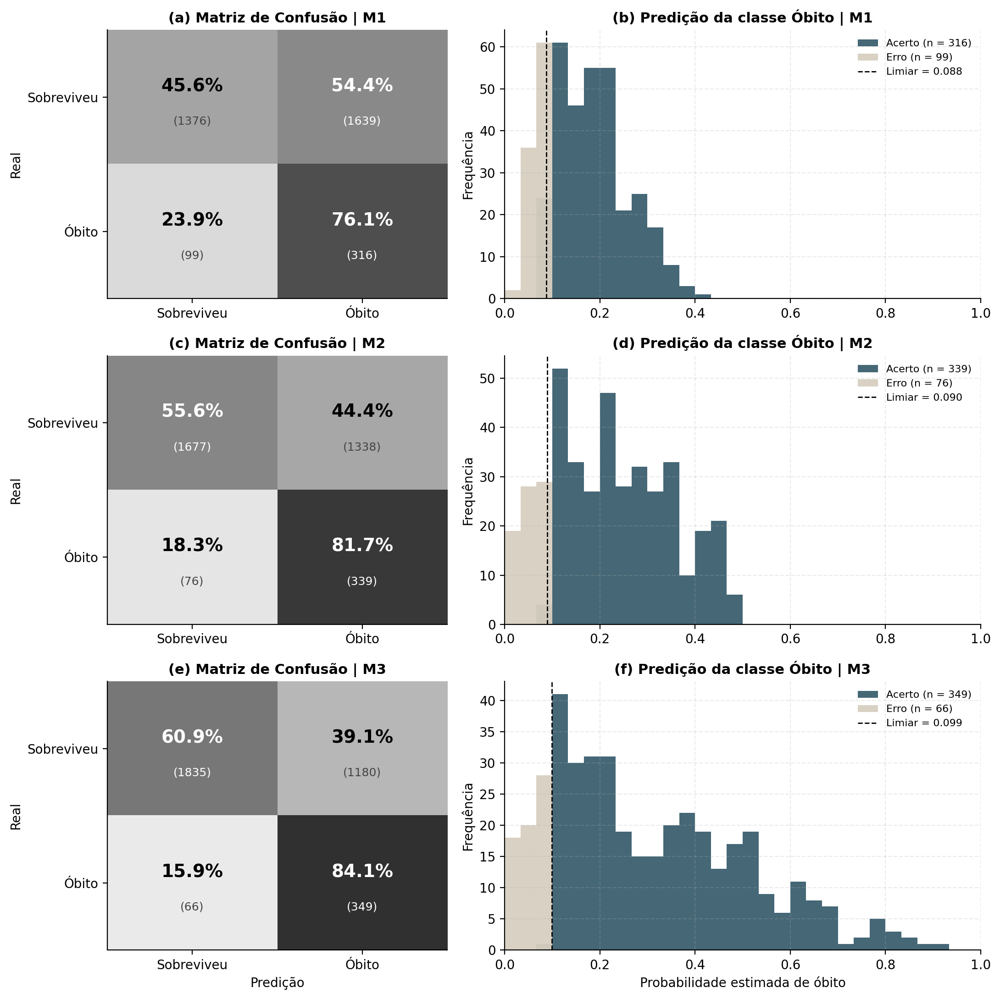
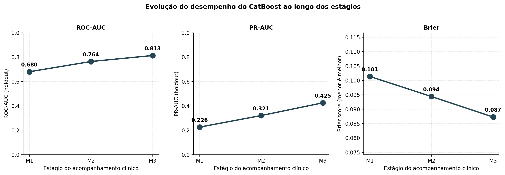
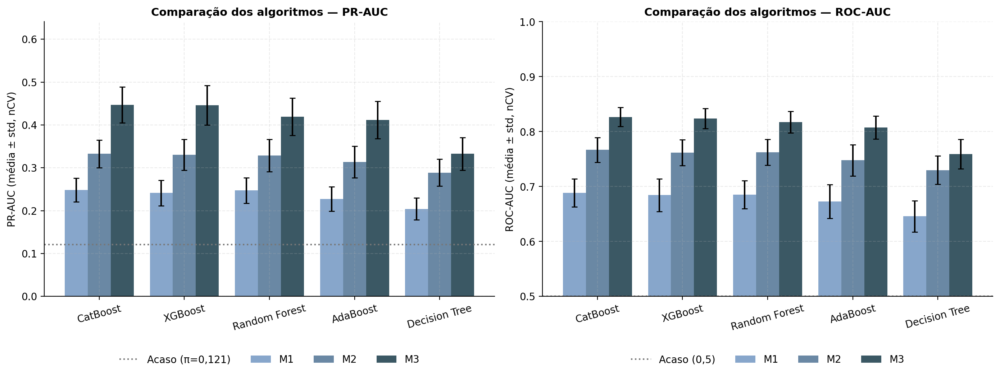
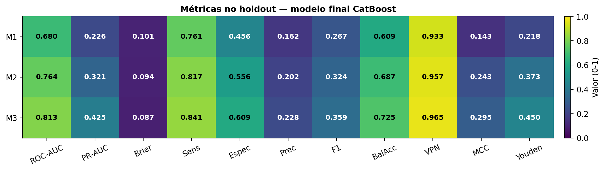
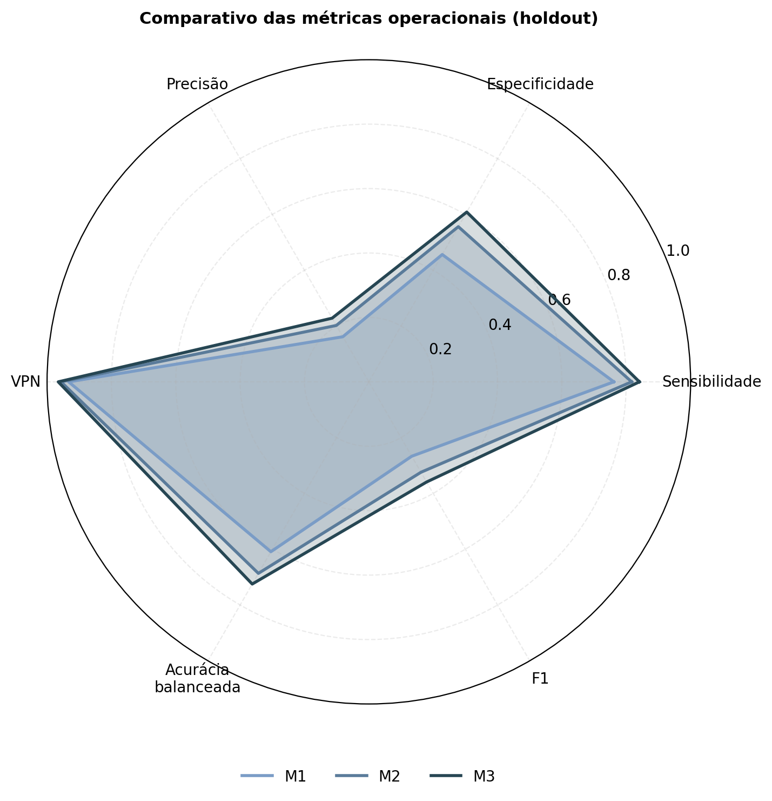
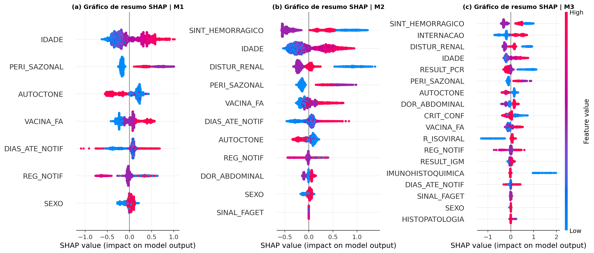

# Predição de Risco de Óbito por Febre Amarela em Diferentes Estágios do Acompanhamento Clínico usando Aprendizado de Máquina

Este repositório acompanha o artigo *"Predição de Risco de Óbito por Febre Amarela em Diferentes Estágios do Acompanhamento Clínico usando Aprendizado de Máquina"*, aceito para publicação no [Simpósio Brasileiro de Computação Aplicada à Saúde (SBCAS) 2026](https://sbcas.sbc.org.br/2026/). Aqui estão reunidos os dados, os notebooks, os modelos finais, os resultados quantitativos e o material suplementar que sustentam o trabalho — em uma forma que esperamos ser útil tanto para quem deseja apenas inspecionar os resultados quanto para quem quer reproduzir todo o pipeline.

A motivação do estudo é simples de descrever, mas o problema é difícil: apesar de existir uma vacina eficaz e barata, a febre amarela ainda mata. No surto brasileiro de 2016–2018 foram 2.155 casos confirmados e 745 óbitos — uma letalidade de 34,6%. A doença evolui rápido e nem sempre de forma previsível, e isso dificulta identificar precocemente quem está em maior risco. Modelos prognósticos baseados em aprendizado de máquina poderiam ajudar nessa estratificação, mas, no caso da febre amarela, ainda são escassos. É essa lacuna que tentamos endereçar.

<p align="center">
  
</p>

## Visão geral

Em vez de propor um único classificador, optamos por treinar uma família de três modelos, um para cada momento clínico em que tipicamente há tomada de decisão sobre o paciente. A ideia é que os atributos disponíveis no momento da notificação não são os mesmos disponíveis depois de uma avaliação clínica inicial, que por sua vez não são os mesmos disponíveis depois que os exames laboratoriais ficam prontos. Treinar um único modelo "completo" e usá-lo em todos os momentos significaria, na prática, vazamento de informação para o futuro — o modelo seria avaliado em condições que ele nunca enfrentaria de fato.

| Modelo | Momento clínico                  | Atributos disponíveis                                                                                  |
| :----: | :------------------------------- | :----------------------------------------------------------------------------------------------------- |
| **M1** | Notificação                      | Sociodemográficos, geográficos, vacinais, sazonais e tempo até a notificação (7 atributos)             |
| **M2** | Avaliação clínica inicial        | M1 + sinais clínicos (sintomas hemorrágicos, distúrbio renal, sinal de Faget, dor abdominal) (11 atributos) |
| **M3** | Fase tardia (evolução clínica)   | M2 + exames laboratoriais (IgM, PCR, histopatologia, imuno-histoquímica, isolamento viral) e indicadores adicionais (18 atributos) |

O pipeline de modelagem combina validação cruzada aninhada estratificada, otimização bayesiana de hiperparâmetros, calibração probabilística, ajuste do limiar de decisão sob custo assimétrico (priorizando sensibilidade) e análise de explicabilidade via SHAP. CatBoost foi o algoritmo vencedor em todas as três bases após uma comparação sistemática contra Decision Tree, Random Forest, AdaBoost e XGBoost.

## Estrutura do repositório

```
Predicao-Risco-Obito-Febre-Amarela/
├── README.md                                       <- Este documento
├── LICENSE                                         <- Licença MIT
├── requirements.txt                                <- Dependências Python
├── wrappers.py                                     <- Classes auxiliares para carregar os .joblib
├── generate_figures.py                             <- Script para regenerar todas as figuras
│
├── bases/                                          <- Conjuntos de dados pré-processados
│   ├── baseModelo1-VigilanciaNaNotificacao.xlsx
│   ├── baseModelo2-RiscoClinicoInicial.xlsx
│   └── baseModelo3-FatoresAssociadosAoObito.xlsx
│
├── notebooks/                                      <- Pipeline de modelagem
│   ├── 1-SelecaoModelo.ipynb                       <- Etapa 1: seleção do algoritmo (nCV + BayesSearchCV)
│   └── 2-BuscaProfundaHiperparametros.ipynb        <- Etapa 2: refino com Optuna, calibração e holdout
│
├── models/                                         <- Modelos finais serializados (CatBoost)
│   ├── README.md
│   ├── final_model_wrapped_catboost_model1.joblib
│   ├── final_model_wrapped_catboost_model2.joblib
│   └── final_model_wrapped_catboost_model3.joblib
│
├── results/                                        <- Resultados quantitativos
│   ├── README.md
│   ├── ranking_modelos_modelo1.csv
│   ├── ranking_modelos_modelo2.csv
│   ├── ranking_modelos_modelo3.csv
│   └── holdout_metrics_full.csv
│
├── docs/                                           <- Material suplementar
│   ├── dicionario_dados.md
│   ├── resultados_completos.md
│   └── reproducibilidade.md
│
└── images/                                         <- Figuras (todas reproduzíveis via generate_figures.py)
    ├── README.md
    ├── figure1_combined.png
    ├── figure2_shap_combined.png
    ├── algorithm_comparison.png
    ├── performance_evolution.png
    ├── metrics_radar.png
    ├── metrics_heatmap.png
    ├── M1/
    ├── M2/
    └── M3/
```

## Sobre os dados

Os dados utilizados neste trabalho são secundários e provêm do **Sistema de Informação de Agravos de Notificação (SINAN)** do Ministério da Saúde do Brasil, obtidos mediante solicitação formal pelo Sistema Eletrônico do Serviço de Informação ao Cidadão (e-SIC). A versão original cobre o período 2000–2018, com 17.905 registros. Após a etapa de pré-processamento descrita no artigo e detalhada em [`docs/dicionario_dados.md`](./docs/dicionario_dados.md), restaram **17.147 instâncias**, das quais **2.076 (12,1%)** correspondem a casos com óbito confirmado.

As três bases pré-processadas usadas pelos notebooks estão disponíveis em [`bases/`](./bases/), uma para cada estágio do acompanhamento. Elas já refletem o pré-processamento realizado — consolidação de códigos do SINAN para representar valores ausentes, remoção de atributos redundantes ou pouco informativos, engenharia de variáveis temporais (`DIAS_ATE_NOTIF`, `MES_SINTOMAS`, `PERI_SAZONAL`) e remoção das instâncias com valores ausentes remanescentes. O dicionário em [`docs/dicionario_dados.md`](./docs/dicionario_dados.md) traz a descrição completa de cada coluna, incluindo a codificação numérica das variáveis categóricas.

## Resultados principais

### Desempenho do modelo final no holdout

O conjunto de holdout corresponde a 20% dos dados (3.430 instâncias, com 415 óbitos), separado de forma estratificada e mantido congelado durante toda a fase de modelagem.

| Modelo | ROC-AUC | PR-AUC | Brier | t* | Sens. | Prec. | F1 | Acur. Bal. | Espec. | VPN | MCC | Youden |
| :----: | :-----: | :----: | :---: | :---: | :---: | :---: | :--: | :--------: | :----: | :--: | :---: | :----: |
| **M1** | 0,680 | 0,226 | 0,101 | 0,088 | 0,761 | 0,162 | 0,267 | 0,609 | 0,456 | 0,933 | 0,143 | 0,218 |
| **M2** | 0,764 | 0,321 | 0,094 | 0,090 | 0,817 | 0,202 | 0,324 | 0,687 | 0,556 | 0,957 | 0,243 | 0,373 |
| **M3** | 0,813 | 0,425 | 0,087 | 0,099 | 0,841 | 0,228 | 0,359 | 0,725 | 0,609 | 0,965 | 0,295 | 0,450 |

> Tabela bruta em [`results/holdout_metrics_full.csv`](./results/holdout_metrics_full.csv).

### Evolução do desempenho ao longo dos estágios

<p align="center">
  
</p>

A PR-AUC evolui de 0,226 para 0,321 e 0,425 — o que corresponde a aproximadamente 1,9, 2,7 e 3,5 vezes o nível de acaso (π = 0,121). Em paralelo, o Brier score cai de 0,101 para 0,087, indicando que as probabilidades estimadas pelo modelo se tornam progressivamente mais bem calibradas conforme novas informações são incorporadas.

### Comparação dos algoritmos

<p align="center">
  
</p>

CatBoost foi o algoritmo vencedor em todas as três bases na *nested cross-validation* (PR-AUC), seguido de perto por XGBoost e Random Forest. O Decision Tree é claramente inferior, como esperado para um modelo de baixa capacidade. A diferença pequena entre os top-3 é compatível com o que se observa na literatura para problemas tabulares deste porte. Tabelas completas em [`results/`](./results) e em [`docs/resultados_completos.md`](./docs/resultados_completos.md).

### Heatmap consolidado

<p align="center">
  
</p>

### Comparativo das métricas operacionais

<p align="center">
  
</p>

### Explicabilidade via SHAP

<p align="center">
  
</p>

A leitura dos gráficos sugere uma transição gradual na natureza dos atributos mais informativos: em M1, predominam variáveis demográficas e epidemiológicas, com `IDADE` ocupando a primeira posição; em M2, sinais clínicos como `SINT_HEMORRAGICO` e `DISTUR_RENAL` ganham protagonismo; em M3, o quadro torna-se mais heterogêneo, com sinais clínicos, indicadores de gravidade e exames laboratoriais — `RESULT_PCR`, `IMUNOHISTOQUIMICA`, `R_ISOVIRAL` — contribuindo de forma significativa.

> [!IMPORTANT]
> Os valores SHAP devem ser interpretados como associações estatísticas aprendidas pelo modelo, não como evidência de causalidade. O comportamento do atributo `VACINA_FA`, por exemplo, pode soar contraintuitivo, mas é compatível com fatores de confusão observacionais (associação com idade) e com padrões de preenchimento das fichas — não com um efeito adverso da vacinação, que é, ao contrário, fator protetor amplamente reconhecido.

### Análise individual por modelo

Cada um dos três modelos possui um conjunto completo de figuras em [`images/M1/`](./images/M1/), [`images/M2/`](./images/M2/) e [`images/M3/`](./images/M3/):

| Arquivo                       | Descrição                                                        |
| :---------------------------- | :--------------------------------------------------------------- |
| `confusion_matrix.png`        | Matriz de confusão normalizada por classe real, no limiar t*     |
| `probability_histogram.png`   | Distribuição das probabilidades estimadas para a classe óbito    |
| `roc_pr_curves.png`           | Curvas ROC e Precision-Recall lado a lado                        |
| `calibration_curve.png`       | Curva de calibração (10 bins por quantis)                        |
| `feature_importance.png`      | Importância nativa do CatBoost                                   |
| `shap_summary.png`            | Beeswarm plot SHAP                                               |
| `shap_importance.png`         | Importância média absoluta SHAP                                  |

## Como reproduzir

### 1) Instalação

```bash
git clone https://github.com/VKusterL/Predicao-Risco-Obito-Febre-Amarela.git
cd Predicao-Risco-Obito-Febre-Amarela

python -m venv .venv
# Linux/macOS:
source .venv/bin/activate
# Windows:
.venv\Scripts\activate

pip install -r requirements.txt
```

> [!CAUTION]
> O ambiente original do artigo utilizou Python 3.13 em Windows 11, processador Intel Core i7-7700K, 16 GB de RAM e GPU NVIDIA GeForce GTX 1070 (não obrigatória — a maior parte das rotinas é executada em CPU). As figuras deste repositório foram regeradas em Python 3.12 com saída numérica idêntica à do artigo, indicando que o pipeline é robusto a pequenas variações de ambiente.

### 2) Pipeline de modelagem

O fluxo é dividido em dois notebooks, executados em sequência para cada uma das três bases.

[`notebooks/1-SelecaoModelo.ipynb`](./notebooks/1-SelecaoModelo.ipynb) implementa o holdout estratificado de 20%, a *nested cross-validation* (10 outer × 10 inner), o `BayesSearchCV` com 90 iterações por algoritmo, o ajuste de limiar OOF sob restrição `recall ≥ 0,7`, e a exportação dos rankings em [`results/`](./results).

[`notebooks/2-BuscaProfundaHiperparametros.ipynb`](./notebooks/2-BuscaProfundaHiperparametros.ipynb) recebe o algoritmo vencedor da Etapa 1 (CatBoost, em todas as bases) e realiza o refinamento com Optuna (300 *trials*, TPE com *pruning*), tratamento explícito de categóricas, *early stopping*, calibração probabilística com *cross-fitting*, ajuste de limiar OOF (`recall ≥ 0,8`), avaliação no holdout com IC 95% por *bootstrap* e geração das figuras e do modelo final em [`models/`](./models).

### 3) Carregando os modelos finais

Os três modelos CatBoost finais estão em [`models/`](./models/). Para carregá-los, use o utilitário [`wrappers.py`](./wrappers.py) — ele recria as classes auxiliares (`FinalModelWithThreshold`, `ProbaCalibratedWrapper`, `NominalPreprocessor` etc.) usadas durante o treinamento, e suporta as duas convenções de atributos diferentes que apareceram entre versões do código (`_num_imputer/_cat_imputer` e `_num_imp/_cat_imp`):

```python
import sys, joblib
sys.path.insert(0, ".")             # garantir wrappers.py no path

import wrappers, __main__
for name in ["FinalModelWithThreshold", "ProbaCalibratedWrapper", "ProbCalibrator",
             "SafeCatBoostClassifier", "NominalPreprocessor", "get_proba"]:
    setattr(__main__, name, getattr(wrappers, name))

modelo = joblib.load("models/final_model_wrapped_catboost_model3.joblib")

proba = modelo.predict_proba(X_novo)[:, 1]               # probabilidade de óbito
pred  = (proba >= modelo.threshold).astype(int)          # decisão binária com t* otimizado
```

### 4) Regenerando todas as figuras

Para regenerar todas as figuras deste repositório a partir dos modelos e bases:

```bash
python generate_figures.py
```

O script carrega cada modelo, separa exatamente o mesmo holdout utilizado no treinamento (`random_state=42`), computa todas as métricas e gera as figuras em `images/`. Os números obtidos coincidem exatamente com a Tabela 4 do artigo, o que serve como uma verificação extra da integridade dos modelos serializados.

## Material suplementar

- [`docs/dicionario_dados.md`](./docs/dicionario_dados.md) — dicionário completo dos atributos (nome, tipo, descrição, categorias e codificação).
- [`docs/resultados_completos.md`](./docs/resultados_completos.md) — tabelas estendidas: ranking dos algoritmos com desvios padrão, métricas OOF, intervalos de confiança *bootstrap*, melhores hiperparâmetros e ranking de importância SHAP por modelo.
- [`docs/reproducibilidade.md`](./docs/reproducibilidade.md) — configurações de *seeds*, *hashes* das bases, espaços de busca de hiperparâmetros, versões de bibliotecas e ambiente computacional.

## Limitações

O estudo utiliza dados secundários de vigilância, sujeitos a inconsistências, sub-registro e potenciais vieses de seleção e preenchimento. Não foi realizada comparação direta com escores clínicos consolidados, o que restringe a análise do ganho incremental do modelo em cenários assistenciais reais. A avaliação é retrospectiva e não mensura impacto operacional em fluxos assistenciais reais. Por fim, a interpretação SHAP fornece associações estatísticas, não relações causais.

Como trabalhos futuros, recomenda-se validação externa multicêntrica, estudos comparativos com protocolos clínicos estabelecidos, avaliações prospectivas e a exploração de abordagens mais avançadas (modelagem temporal explícita, aprendizado contínuo).

## Citação

```bibtex
TODO
```

## Agradecimentos

Os autores agradecem o apoio das agências de fomento CNPq, CAPES e FAPEMIG, bem como ao Ministério da Saúde do Brasil pela disponibilização dos dados via Sistema Eletrônico do Serviço de Informação ao Cidadão (e-SIC).

## Contato — autores

- **[Vinicius K. Lodi](https://github.com/VKusterL)** — Universidade Federal de Viçosa — vinicius.lodi@ufv.br
- **Cleber L. Oliveira Junior** — Universidade Federal de Viçosa — cleber.luiz@ufv.br
- **Fabio R. Cerqueira** — Universidade Federal Fluminense — frcerqueira@id.uff.br
- **Karen O. Fracalossi** — Universidade Federal de Viçosa — karen.fracalossi@ufv.br
- **Glauce D. da Costa** — Universidade Federal de Viçosa — glauce.costa@ufv.br
- **[Daniel L. Fernandes](https://github.com/daniellf)** — Universidade Federal de Viçosa — daniel.louzada@ufv.br

## Licença

Distribuído sob a [Licença MIT](./LICENSE). Os modelos treinados e códigos podem ser usados, modificados e redistribuídos para fins acadêmicos e de pesquisa, com a devida citação.
